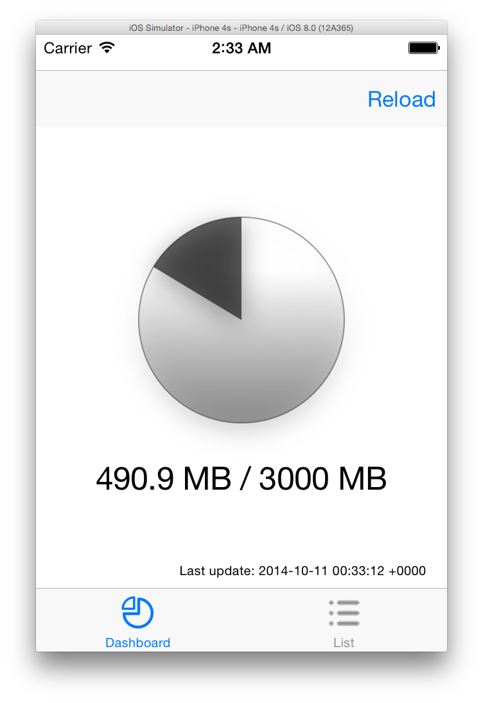

# Congstar Counter

Work in progress...

## To do

* ...

## Credits

* Icons made by Amit Jakhu from [www.flaticon.com](http://www.flaticon.com) ([CC BY 3.0](http://creativecommons.org/licenses/by/3.0/))
* [AFNetworking](https://github.com/AFNetworking/AFNetworking) (MIT)
* [Regexer](https://github.com/fortinmike/Regexer) (MIT)
* [FMDB](https://github.com/ccgus/fmdb) (MIT)
* [Chartreuse](https://github.com/dainkaplan/Chartreuse) (Artistic License 2.0)

## License

Congstar Counter is available under the MIT license. See the LICENSE file for more info.
